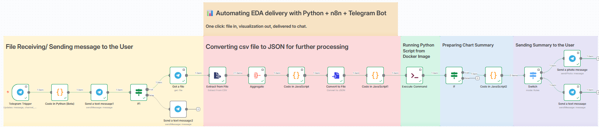

# 📊 From File → Charts → Telegram 🚀  
**Automated Exploratory Data Analysis (EDA) Pipeline with Python + n8n + Telegram**
  
Turn raw data files into **insightful charts + summaries** delivered directly to your **Telegram bot** — all in seconds.  

---

## ⚡ Workflow Overview  

1. **Upload a file (CSV)** via Telegram  
2. **n8n workflow** triggers a Python EDA script  
3. **Python (Pandas, NumPy, Seaborn, Matplotlib)** generates:  
   - 📈 Clean charts (PNG)  
   - 📝 JSON summary (insights, correlations, missing values)  
4. **n8n Code node** prepares binary + text payload  
5. **Telegram bot** receives:  
   - Chart as an image  
   - Human-readable text summary  

---
📂 Project Structure

```bash
.
├── n_test.py               # Python script for EDA
├── Dockerfile              # Docker File to copy local script to Docker Desktop 
├── docker-compose          # File to build Docker Image 
├── requirements.txt        # Python dependencies
├── assets/
│   └── workflow.png        # Workflow diagram (README preview)   
└── README.md
```

## 🖼️ Workflow Diagram  

  

---

## 🛠️ Tech Stack  

- **[Python](https://www.python.org/)** 🐍 → Data wrangling + visualization  
  - Pandas · NumPy · Seaborn · Matplotlib  
- **[n8n](https://n8n.io/)**   → Workflow automation engine  
- **[Telegram Bot API](https://core.telegram.org/bots/api)**   → File input + message delivery  
- **Docker** 🐳→ For containerization of the entire process.

---

## 🎥 Demo  
Check out the workflow in action: 

https://github.com/user-attachments/assets/b51882dc-fb47-4580-90b0-0993bba4d8a9

---
## Guide on how to create Custom Docker Image with Python Libraries for n8n ?

**Step 1:** Create Dockerfile. Use Dockerfile in this repo.

**Step 2:** Create docker-compose.yml file. Use docker-compose.yml in this repo

**Step 3:** Watch this video, before running below code: https://www.youtube.com/watch?v=RvAD2__YYjg

This video is the solution for the issue, you will encounter while running n8n via Docker. The error is "**Bad Request: bad webhook: An HTTPS URL must be provided for webhook**"
   ```bash 
   docker compose up -d
   ```
**Step 4:** Running Python Script in n8n.

 - **Step 4.1:** Add "Code" Node with Language selected as JavaScript, and add below code. This code will output the filepath where the JSON converted file is saved in n8n. 

    **Question** Where to add "Code" Node ? See Red box under Workflow Diagram.

   ```bash 
   return [{
   filePath: `/home/node/.n8n/binaryData/${$binary.data.id.replace('filesystem-v2:', '')}`
   }];
   ```
 - **Step 4.2:** Add "Execute Command" node after the "Code" Node. Under "Command" property add below code. This Code passes the file path received from "Code" node to python script copied inside the Docker image.

   ```bash 
   python3 /tmp/n_test.py "{{$json.filePath}}"
   ```

**Step 5:** All done!!

---

## ✨ Features

📊 Charts + correlations out of the box

📱 Delivered right into Telegram

### 🔗 Links

- [n8n Documentation](https://n8n.io/docs/)
- [Telegram Bot API](https://core.telegram.org/bots/api)
- [Docker Documentation](https://docs.docker.com/)